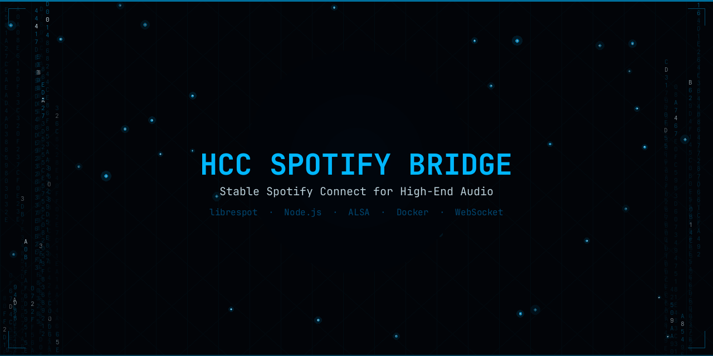
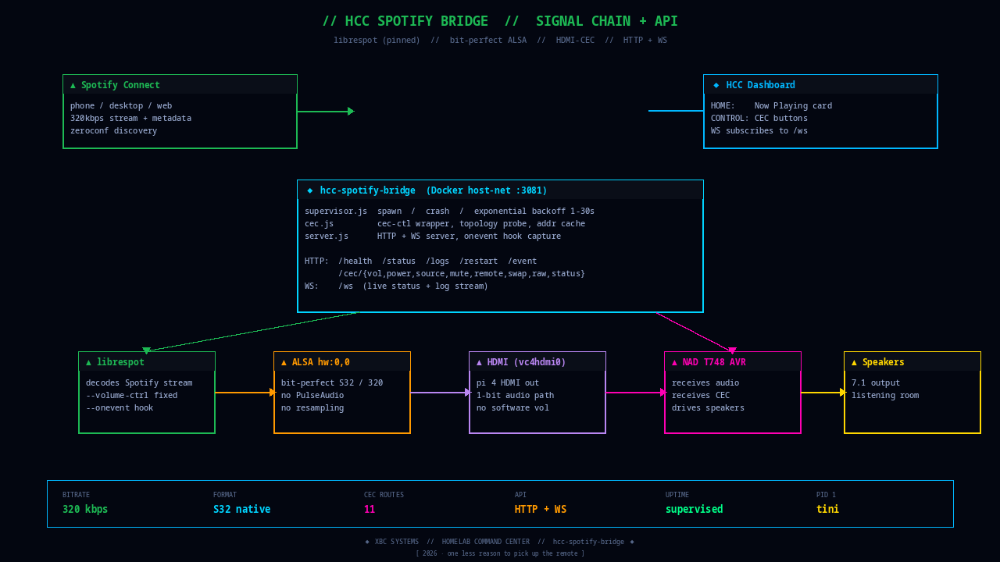

<div align="center">

[](https://techxmaestro.com)
[](https://github.com/xbc4000?tab=repositories)
[]()



# HCC SPOTIFY BRIDGE

**Spotify Connect + HDMI-CEC for high-end audio, bit-perfect to the AVR.**

librespot supervised with auto-restart · direct ALSA bit-perfect passthrough · full HDMI-CEC control of the NAD (power, volume, mute, source, remote keys) · HTTP + WebSocket API · HCC Dashboard live Now-Playing and Control panels

[](#)
[](#)
[](#)
[](#)
[](#)
[](#)


</div>

---

## Table of Contents

- [Why This Exists](#why-this-exists)
- [Reference Rig](#reference-rig)
- [Features](#features)
- [Where It Shows Up](#where-it-shows-up)
- [Architecture](#architecture)
- [Configuration](#configuration)
- [Deploy](#deploy)
- [API](#api)
- [HDMI-CEC](#hdmi-cec)
- [Raspotify Comparison](#raspotify-comparison)

---

## Why This Exists

Raspotify crashes on long-running setups. It doesn't restart cleanly. The package lags upstream librespot by months. Configuration is a flat text file with no visibility into what's happening. When it goes silent on a Friday night, you're SSHing into a Raspberry Pi to restart a systemd unit while your music is dead.

And even when it works, it only does *half the job*: audio. The AVR still needs a physical remote for volume, power, and input switching. That breaks the dream of "one place to control the listening room."

This bridge fixes both problems: **supervised librespot + HDMI-CEC control of the AVR** from the same HTTP/WebSocket API.

---

## Reference Rig

The bridge is tuned and tested against a real hi-fi system, not a TV soundbar. Every default here — bit-perfect path, no DSP, no normalisation, no soft volume — exists because losses are audible on this chain.

| Role | Gear |
|------|------|
| **Source bridge** | Raspberry Pi 4 (DietPi) running this container |
| **AVR** | NAD T-748 (HDMI switching + 7.1 amp, CEC-capable) |
| **Fronts L/R** | Paradigm Monitor 7 v.4 towers |
| **Surrounds** | Paradigm Cinema ADP v.3 (dipole/bipole, 5.1 rear) |
| **Front heights** | Paradigm ADP v.3 (pair, used as height channels) |
| **Subs** | dual Paradigm PS-1000 |

Signal path: **Phone → librespot (Pi) → ALSA `hdmi:CARD=vc4hdmi0,DEV=0` → HDMI 2 → NAD T-748 → Monitor 7s + PS-1000s**.

CEC topology: NAD is logical address 5, the Pi claims a Playback device at physical address `1.2.0.0`. Phone Spotify slider drives real analog volume on the NAD via CEC up/down events — no software attenuation in the digital path.

Nothing in the bridge is NAD- or Paradigm-specific; the tuning (format, normalisation defaults, volume-ctrl mode) is the part that matters. If you're on a different AVR, check the [Configuration](#configuration) section — every quirk is an env var.

---

## Features

### Audio Path
- **Managed librespot** — spawns as a subprocess, auto-restarts on any crash with exponential backoff (1s → 30s max), resets after 60s of stability
- **Bit-perfect ALSA** — `hdmi:CARD=vc4hdmi0,DEV=0` direct IEC958 passthrough, no PulseAudio, no PipeWire, no resampling
- **Phone slider → AVR volume** — librespot runs `--volume-ctrl log`, volume_changed events are translated into real HDMI-CEC volume steps on the AVR (opt-in via `CEC_BRIDGE_VOLUME=on`)
- **No normalisation by default** — Spotify's -14 LUFS loudness target would attenuate loud masters 3-6 dB before HDMI; disabled for maximum digital level. Opt back in with `LIBRESPOT_NORMALISATION=on` + `LIBRESPOT_NORMALISATION_PREGAIN=6` for consistent playlist loudness.
- **320 kbps / S16** — Spotify's top-tier Vorbis bitrate, decoded to S16 PCM (vc4hdmi's native IEC958 format; higher bit depths are rejected by the driver)
- **Pinned binary** — librespot version locked in the Dockerfile, upgrades are deliberate
- **Tini PID 1** — proper signal propagation, clean container shutdown

### HDMI-CEC (NAD AVR remote)
- **Volume** — up, down, absolute set, mute toggle
- **Power** — on, standby
- **Source** — active / inactive, set HDMI input
- **Remote keys** — play, pause, stop, prev, next, menu, back, select, colour buttons — everything the original remote has
- **Raw passthrough** — send any `cec-ctl` command for edge-case debugging
- **Topology probe** — on startup, the bridge walks the HDMI bus so it can talk to the AVR specifically, not just broadcast

### Eventing + API
- **Event capture** — every librespot state change (play, pause, track, connect, disconnect) captured via `--onevent` hook
- **Live dashboard** — HCC dashboard shows real-time playback without ever touching Spotify's Web API
- **HTTP + WebSocket** — pull via `GET /status`, subscribe via `WS /ws` for push

---

## Where It Shows Up

The bridge is headless, but two panels in the [HCC Dashboard](https://github.com/xbc4000/hcc-dashboard) live off its API:

<table>
<tr>
<td align="center" width="50%">
<a href="https://github.com/xbc4000/hcc-dashboard/blob/main/docs/screenshots/01-home.png">
</a><br>
<sub><b>HOME</b> — live Now-Playing card (top-right) reads <code>/status</code>, WebSocket push, album art, progress bar</sub>
</td>
<td align="center" width="50%">
<a href="https://github.com/xbc4000/hcc-dashboard/blob/main/docs/screenshots/12-control.png">
</a><br>
<sub><b>CONTROL</b> — SPOTIFY CONNECT + AVR LIGHTS + transport keys wired to the <code>/cec/*</code> and <code>/restart</code> endpoints</sub>
</td>
</tr>
</table>

---

## Architecture

<div align="center">

</div>

<sub>Regenerate with <code>python3 scripts/generate-architecture.py</code>.</sub>

### ASCII breakdown

```
RPi 4  (host network — required for zeroconf + CEC)
|
+-- librespot  (subprocess supervised by supervisor.js)
|      |
|      +-- audio:    ALSA hw:0,0 --> vc4hdmi0 --> HDMI --> NAD AVR
|      |
|      +-- --onevent hook (scripts/librespot-event.sh)
|             POST /event --> bridge
|
+-- hcc-spotify-bridge  (Node.js)        :3081
|      |
|      +-- supervisor.js
|      |     spawn / crash detect / exponential backoff (1s -> 30s)
|      |     state cache (track, device, connect status)
|      |
|      +-- cec.js
|      |     wraps `cec-ctl` for power / volume / source / keys
|      |     topology probe on boot (finds NAD LA and remembers it)
|      |
|      +-- server.js
|             HTTP:
|                GET  /health            container liveness
|                GET  /status            full playback state
|                GET  /logs?n=100        recent log lines
|                POST /restart           manual librespot restart
|                POST /event             internal (onevent hook)
|                POST /cec/vol/{up,down} + /cec/mute
|                POST /cec/power/{on,off}
|                POST /cec/source/{active,inactive,set}
|                POST /cec/remote/:key
|                POST /cec/raw           raw cec-ctl passthrough
|                GET  /cec/status        bus topology + last command
|                POST /cec/swap          re-probe HDMI topology
|             WebSocket:
|                /ws                     live status + log stream
|
+-- HCC Dashboard consumes /spotify-bridge/* via Caddy reverse-proxy
```

---

## Configuration

All via environment variables:

| Variable | Default | Notes |
|----------|---------|-------|
| `BRIDGE_PORT` | `3081` | HTTP/WS port |
| `LIBRESPOT_NAME` | `NAD-AVR` | Spotify Connect display name |
| `LIBRESPOT_DEVICE` | `hw:0,0` | ALSA device — run `aplay -l` to confirm |
| `LIBRESPOT_DEVICE_TYPE` | `avr` | Icon in Connect picker: `speaker`, `avr`, `tv`, `stb`, `audio_dongle`, `computer`, `smartphone` |
| `LIBRESPOT_BITRATE` | `320` | `96`, `160`, `320` |
| `LIBRESPOT_FORMAT` | `S32` | `S16`, `S24`, `S24_3`, `S32`, `F32` |
| `LIBRESPOT_INITIAL_VOLUME` | `100` | 0-100 (fixed, no software volume) |
| `LIBRESPOT_DISABLE_DISCOVERY` | unset | `on` to disable zeroconf |
| `LIBRESPOT_BIN` | `/usr/local/bin/librespot` | |
| `LIBRESPOT_CACHE` | `/app/data/librespot` | Persisted via Docker volume |
| `CEC_DEVICE` | `/dev/cec0` | Host CEC device — `cec-ctl --list-devices` to confirm |
| `CEC_TARGET` | auto | Logical address discovered by the topology probe; override if needed |

---

## Deploy

### Build

```bash
git clone git@github.com:xbc4000/hcc-spotify-bridge.git
cd hcc-spotify-bridge
docker build -t hcc-spotify-bridge:latest .
```

### Portainer Stack

```yaml
services:
  hcc-spotify-bridge:
    image: hcc-spotify-bridge:latest
    container_name: hcc-spotify-bridge
    restart: unless-stopped
    network_mode: host
    devices:
      - /dev/snd:/dev/snd
      - /dev/cec0:/dev/cec0
    group_add:
      - audio
      - video
    volumes:
      - /var/run/dbus:/var/run/dbus:ro
      - /var/run/avahi-daemon:/var/run/avahi-daemon:ro
      - hcc-spotify-data:/app/data
    environment:
      - LIBRESPOT_NAME=NAD-AVR
      - LIBRESPOT_DEVICE=hw:0,0
      - LIBRESPOT_DEVICE_TYPE=avr
      - LIBRESPOT_BITRATE=320
      - LIBRESPOT_FORMAT=S32

volumes:
  hcc-spotify-data:
    driver: local
```

**Why those mounts matter**
- `/dev/cec0` — the HDMI-CEC kernel device, required for every `/cec/*` route
- `/dev/snd` + `audio` group — ALSA output
- `video` group — CEC (on many distros the CEC device group is `video`, not its own group)
- `/var/run/dbus` + `/var/run/avahi-daemon` — zeroconf/mDNS publishing so "NAD-AVR" actually appears in the Spotify Connect device picker. Without these the container happily runs but is invisible.
- `network_mode: host` — mandatory. Zeroconf doesn't cross the Docker bridge.

### First-Time Claim

1. Start the container — librespot advertises "NAD-AVR" via zeroconf
2. Open Spotify on a device on the **same broadcast domain** as the RPi
3. Tap NAD-AVR in the Connect picker — Spotify links it to your account
4. After claim, NAD-AVR appears globally on every device on your account

**Cross-VLAN workaround:** Plug a laptop directly into the RPi's LAN (or temporarily put it on VLAN40), claim, unplug. Done forever.

---

## API

```bash
# Health
curl http://10.40.40.2:3081/health

# Full playback state
curl http://10.40.40.2:3081/status | jq

# Recent logs
curl 'http://10.40.40.2:3081/logs?n=50' | jq

# Manual librespot restart
curl -X POST http://10.40.40.2:3081/restart

# Live WebSocket stream (status + log events)
websocat ws://10.40.40.2:3081/ws

# CEC — AVR control
curl -X POST http://10.40.40.2:3081/cec/power/on
curl -X POST http://10.40.40.2:3081/cec/vol/up
curl -X POST http://10.40.40.2:3081/cec/mute
curl -X POST http://10.40.40.2:3081/cec/source/set -d '{"input":"hdmi1"}' -H 'content-type: application/json'
curl -X POST http://10.40.40.2:3081/cec/remote/play
curl    http://10.40.40.2:3081/cec/status | jq
```

---

## HDMI-CEC

Every HDMI source on the NAD bus gets a logical address. The bridge's `cec.js` wraps `cec-ctl` — shelling out is cheap (low-frequency user input), simple (no native bindings to rebuild across kernels), and already handles the protocol edge cases.

**Boot sequence**
1. `cec-ctl --show-topology` — walk the bus, discover the AVR
2. Cache its logical address so later commands target it directly instead of broadcasting
3. `/cec/swap` forces a re-probe if you physically change HDMI wiring

**Remote keys** (via `/cec/remote/:key`)
`play` `pause` `stop` `prev` `next` `menu` `back` `select` `up` `down` `left` `right` `red` `green` `yellow` `blue` `exit` `home` `info` `power`

All of these appear as press-and-release sequences to the AVR — same as the physical remote.

---

## Raspotify Comparison

| | Raspotify | HCC Spotify Bridge |
|---|-----------|-------------------|
| **librespot version** | Lags upstream by months | Pinned in Dockerfile, deliberate upgrades |
| **Crash recovery** | systemd unit, unreliable | Exponential backoff (1s → 30s), tested |
| **Status visibility** | `journalctl` only | HTTP + WS API + HCC dashboard card |
| **Configuration** | Flat text file | env vars in Portainer |
| **ALSA path** | Often routes through PulseAudio | Direct `hw:0,0`, bit-perfect |
| **Volume** | Software by default | Fixed; AVR controls |
| **AVR remote** | Not in scope | **Full HDMI-CEC** (power, vol, mute, source, keys) |
| **Boot reliability** | "Sometimes" | `restart: unless-stopped` + Tini PID 1 |
| **Signal handling** | systemd PID management | Tini, clean propagation |

---

<div align="center">

<a href="https://www.techxmaestro.com">
  <picture>
    <source media="(prefers-color-scheme: dark)" srcset="https://raw.githubusercontent.com/xbc4000/homelab-network/main/assets/branding/techx-maestro.png">
    
  </picture>
</a>

<sub><b>HCC</b> (Homelab Command Center) is a product of <a href="https://www.techxmaestro.com"><b>TechX Maestro</b></a>.</sub>

<sub>HCC repos · <a href="https://github.com/xbc4000/hcc-dashboard">hcc-dashboard</a> · <a href="https://github.com/xbc4000/homelab-network">homelab-network</a> · <a href="https://github.com/xbc4000/xbc4000.github.io">HCC Startpage</a></sub>

</div>
